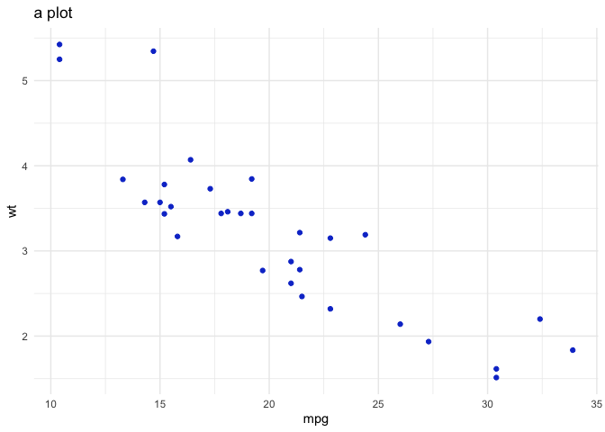

theme-template
================

<style type="text/css">

body{ /* Normal  */
      font-size: 12px;
  }
td {  /* Table  */
  font-size: 8px;
}
h1.title {
  font-size: 38px;
  color: #113CCF;
}
h1 { /* Header 1 */
  font-size: 28px;
  color: #113CCF;
}
h2 { /* Header 2 */
    font-size: 22px;
  color: #113CCF;
}
h3 { /* Header 3 */
  font-size: 18px;
  color: #113CCF;
}
code.r{ /* Code block */
    font-size: 12px;
}
pre { /* Code block - determines code spacing between lines */
    font-size: 14px;
}
</style>
Title
=====

Some text might go here

Sub-title
---------

Look, a plot.

``` r
disney_blue <- '#113CCF'
disney_tq <- '#BFF5FD'

library(ggplot2)
library(dplyr)

mtcars %>%
  ggplot() +
  aes(x = mpg, y = wt) +
  geom_point(col = disney_blue) +
  theme_minimal() +
  labs(title = 'a plot')
```



### Sub-sub-title

Maybe more text?
